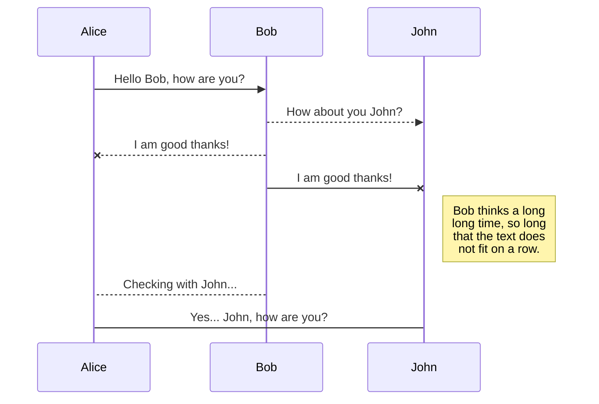
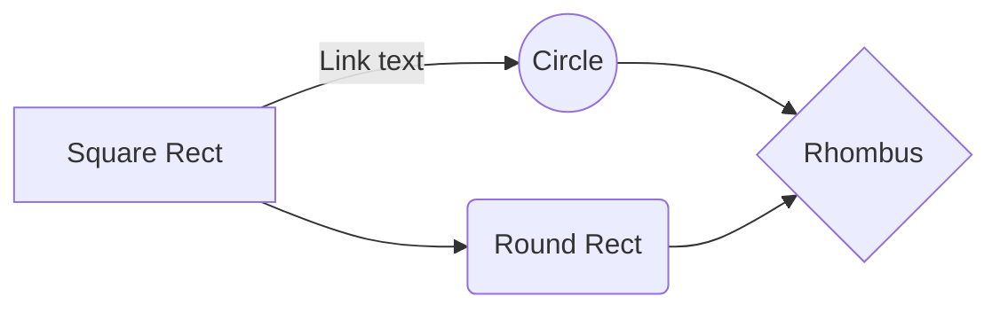

# OpenSMILE Feature extraction

**OpenSMILE** "world-class audio analysis toolkit" 

This python script runs over all the .wav files in a folder and creates CSV file that contains columns with all the feature according to the configuration file.

**Note:**
The script is based on **SMILExtract** executable file that was compiling on **Ubuntu 18.04.4 LTS**.

I added also some conf files based on the ones you can find in the official  site [https://www.audeering.com/download/opensmile-2-3-0-zip/](https://www.audeering.com/download/opensmile-2-3-0-zip/)

Using the conf files in this repo will get CSV that contains:

 1. The wav file name
 2. Frame index
 3. Frame time
 4. All the features defined in the conf flie

You can't create your own conf file following the *openSMILE-latest-book.pdf*
that can also be found in:

[https://www.audeering.com/download/opensmile-2-3-0-zip/](https://www.audeering.com/download/opensmile-2-3-0-zip/)

Other good information can be found in:

[https://stackoverflow.com/questions/43555779/how-to-create-custom-config-files-in-opensmile](https://stackoverflow.com/questions/43555779/how-to-create-custom-config-files-in-opensmile)

**Note:**
Editing conf file using Edit them with Sublime Tesx  Editor may cause problems.
# Files

StackEdit stores your files in your browser, which means all your files are automatically savedenter code here locally and are accessible **offline!**

## Create files and folders

The file explorer is accessible using the button in left corner of the navigation bar. You can create a new file by clicking the **New file** button in the file explorer. You can also create folders by clicking the **New folder** button.

## Switch to another file

All your files and folders are presented as a tree in the file explorer. You can switch from one to another by clicking a file in the tree.

## Rename a file

You can rename the current file by clicking the file name in the navigation bar or by clicking the **Rename** button in the file explorer.

> **Note:** The **Synchronize now** button is disabled if you have no file to synchronize.

## Manage file synchronization

Since one file can be synced with multiple locations, you can list and manage synchronized locations by clicking **File synchronization** in the **Synchronize** sub-menu. This allows you to list and remove synchronized locations that are linked to your file.

# Publication

Publishing in StackEdit makes it simple for you to publish online your files. Once you're happy with a file, you can publish it to different hosting platforms like **Blogger**, **Dropbox**, **Gist**, **GitHub**, **Google Drive**, **WordPress** and **Zendesk**. With [Handlebars templates](http://handlebarsjs.com/), you have full control over what you export.

> Before starting to publish, you must link an account in the **Publish** sub-menu.

## Update a publication

After publishing, StackEdit keeps your file linked to that publication which makes it easy for you to re-publish it. Once you have modified your file and you want to update your publication, click on the **Publish now** button in the navigation bar.

> **Note:** The **Publish now** button is disabled if your file has not been published yet.

## Manage file publication

Since one file can be published to multiple locations, you can list and manage publish locations by clicking **File publication** in the **Publish** sub-menu. This allows you to list and remove publication locations that are linked to your 
> **ProTip:** You can disable any **Markdown extension** in the **File properties** dialog.

## SmartyPants

SmartyPants converts ASCII punctuation characters into "smart" typographic punctuation HTML entities. For example:

|                |ASCII                          |HTML                         |
|----------------|-------------------------------|-----------------------------|
|Single backticks|`'Isn't this fun?'`            |'Isn't this fun?'            |
|Quotes          |`"Isn't this fun?"`            |"Isn't this fun?"            |
|Dashes          |`-- is en-dash, --- is em-dash`|-- is en-dash, --- is em-dash|

## KaTeX

You can render LaTeX mathematical expressions using [KaTeX](https://khan.github.io/KaTeX/):

The *Gamma function* satisfying $\Gamma(n) = (n-1)!\quad\forall n\in\mathbb N$ is via the Euler integral

$$
\Gamma(z) = \int_0^\infty t^{z-1}e^{-t}dt\,.
$$

> You can find more information about **LaTeX** mathematical expressions [here](http://meta.math.stackexchange.com/questions/5020/mathjax-basic-tutorial-and-quick-reference).

## UML diagrams

You can render UML diagrams using [Mermaid](https://mermaidjs.github.io/). For example, this will produce a sequence diagram:

And this will produce a flow chart:

