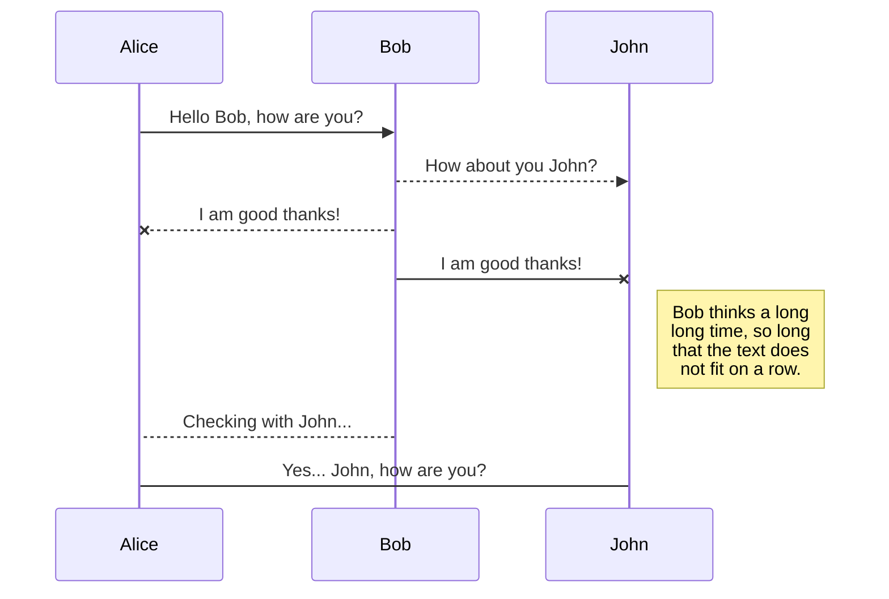
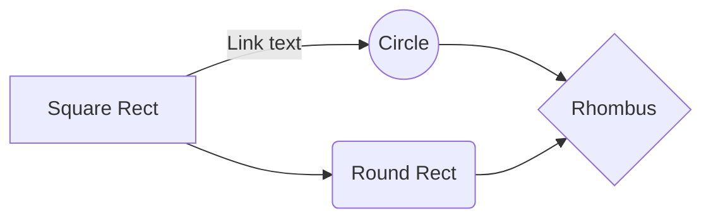

# OpenSMILE Feature extraction

**OpenSMILE** "world-class audio analysis toolkit" 

This python script runs over all the .wav files in a folder and creates CSV file that contains columns with all the feature according to the configuration file.

>**Note:** The script is based on **SMILExtract** executable file that was compiling on **Ubuntu 18.04.4 LTS**.

Using the *.conf* files in this repo will get CSV that contains:

 1. The wav file name
 2. Frame index
 3. Frame time
 4. All the features defined in the configuration flie

You can create your own configuration file following the *openSMILE-latest-book*
from the [official site](https://www.audeering.com/download/opensmile-2-3-0-zip)

Other good information for making configuration files can be found in:

[https://stackoverflow.com/questions/43555779/how-to-create-custom-config-files-in-opensmile](https://stackoverflow.com/questions/43555779/how-to-create-custom-config-files-in-opensmile)

> **Note:** 
Editing conf file using *Sublime Text* editor may cause problem to executable file to read them. 
# Files

> **Note:** The **Synchronize now** button is disabled if you have no file to synchronize.

## Manage file synchronization

Since one file can be synced with multiple locations, you can list and manage synchronized locations by clicking **File synchronization** in the **Synchronize** sub-menu. This allows you to list and remove synchronized locations that are linked to your file.

# Publication

Publishing in StackEdit makes it simple for you to publish online your files. Once you're happy with a file, you can publish it to different hosting platforms like **Blogger**, **Dropbox**, **Gist**, **GitHub**, **Google Drive**, **WordPress** and **Zendesk**. With [Handlebars templates](http://handlebarsjs.com/), you have full control over what you export.

> Before starting to publish, you must link an account in the **Publish** sub-menu.

## Update a publication

After publishing, StackEdit keeps your file linked to that publication which makes it easy for you to re-publish it. Once you have modified your file and you want to update your publication, click on the **Publish now** button in the navigation bar.

> **Note:** The **Publish now** button is disabled if your file has not been published yet.

## Manage file publication

Since one file can be published to multiple locations, you can list and manage publish locations by clicking **File publication** in the **Publish** sub-menu. This allows you to list and remove publication locations that are linked to your 
> **ProTip:** You can disable any **Markdown extension** in the **File properties** dialog.

## CVS Examples

When using *emobase_full_frame_2_csv*  the files head :

|    name                                 |pcm_intensity_sma_variance|pcm_intensity_sma_stdd|
|-----------------------------------------|--------------------------|-------------------------
|'example-audio/media-interpretation.wav' |5.729106e-12              |2.393555e-06          |
|'example-audio/opensmile.wav'            |1.634973e-11              |4.043480e-06          |

When using *emobase_25ms_frames_2_csv*  the files head :

|name                                    |frameIndex|frameTime   |pcm_intensity_sma_variance|
|----------------------------------------|----------|------------|--------------------------|
|'example-audio/media-interpretation.wav'|0         |0.012500    |2.828065e-21              |
|'example-audio/media-interpretation.wav'|1         |0.012500    |9.548435e-21              |
|'example-audio/media-interpretation.wav'|2         |0.020006    |5.578462e-21              |
|'example-audio/media-interpretation.wav'|3         |0.030006    |1.493910e-21              |

## KaTeX

You can render LaTeX mathematical expressions using [KaTeX](https://khan.github.io/KaTeX/):

The *Gamma function* satisfying $\Gamma(n) = (n-1)!\quad\forall n\in\mathbb N$ is via the Euler integral

$$
\Gamma(z) = \int_0^\infty t^{z-1}e^{-t}dt\,.
$$

> You can find more information about **LaTeX** mathematical expressions [here](http://meta.math.stackexchange.com/questions/5020/mathjax-basic-tutorial-and-quick-reference).

## UML diagrams

You can render UML diagrams using [Mermaid](https://mermaidjs.github.io/). For example, this will produce a sequence diagram:

And this will produce a flow chart:

